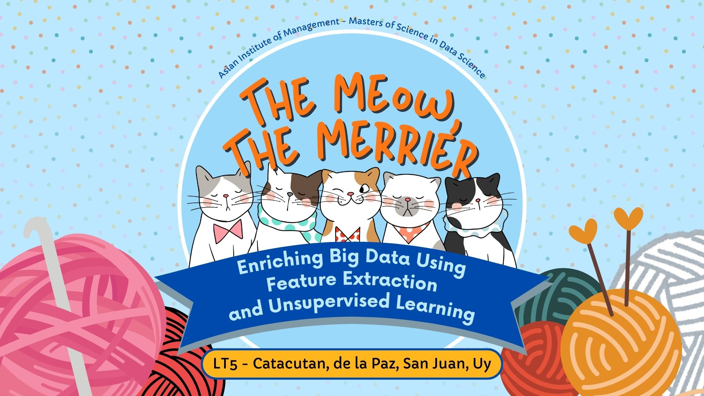

# The Meow the Merrier: Enriching Big Data by Using Feature Extraction and Unsupervised Learning

## Authors
Kyle Uy, Jason Catacutan, Joshua San Juan, Lorenzo de la Paz

## Contents
This repository contains all relevant files and notebooks for the production of the project "The Meow the Merrier". Several image files as well as notebooks are contained within, necessary for the display and execution of the project.
What is not contained is the actual dataset, as given the nature of Big Data is not feasible to store and access here. 

## Abstract
This study introduces a novel hybrid pipeline approach for unsupervised learning, applied to big data analysis on AWS PySpark. Leveraging VGG16 for feature extraction from a dataset of synthetically generated images, we successfully clustered the images into two distinct categories: well-generated, defined images, and distorted ones. Further analysis revealed subclusters within these categories, indicating nuanced differences in image quality.

The ability to generate subclasses within synthetic data, without relying on pre-labeled datasets, could revolutionize the AI development landscape. It promises to alleviate the current bottleneck of manual data labeling, significantly reducing development costs and timelines. Smaller players in the AI field could benefit immensely from this approach, leveling the playing field and fostering innovation.

Moreover, this research has far-reaching implications for large language models (LLMs) and generative AI. Unsupervised labels generated through this method could be used to fine-tune these models, leading to significant improvements in various domains.  This opens the door for AI systems that not only process information but actively refine their understanding of the world through unsupervised learning.

While this study marks a preliminary step, the implications are profound. By introducing this simple yet potentially effective technique, we pave the way for a more efficient, inclusive, and advanced future for artificial intelligence.

**Keywords:** Big Data, Cloud Computing, Amazon Web Services, Clustering, Unsupervised Learning, Machine Learning, AI

## Acknowledgement
This project was created under the careful guidance and mentorship of the esteemed professors of the Asian Institute of Management. Without their tireless support this project would not have come into fruition. 

## Getting Started

The dataset used for the project can be accessed [here](https://www.kaggle.com/datasets/chelove4draste/1-million-cats). The total dataset is quite large around 100 GBs. To properly pre-process the data, Amazon Web Serivces Elastic Cloud Compute was used. The team used a total of 16 mx.5 machines to efficiently process the data.

The main notebook is not meant to be run from top to bottom, and it must be run on a Pyspark environment. Ensure that all images are properly downloaded to ensure no issues when displaying them within the notebook. 
